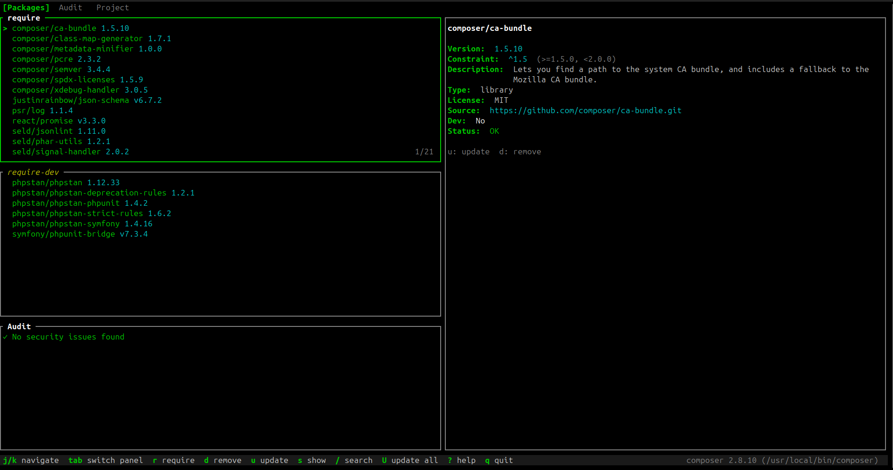
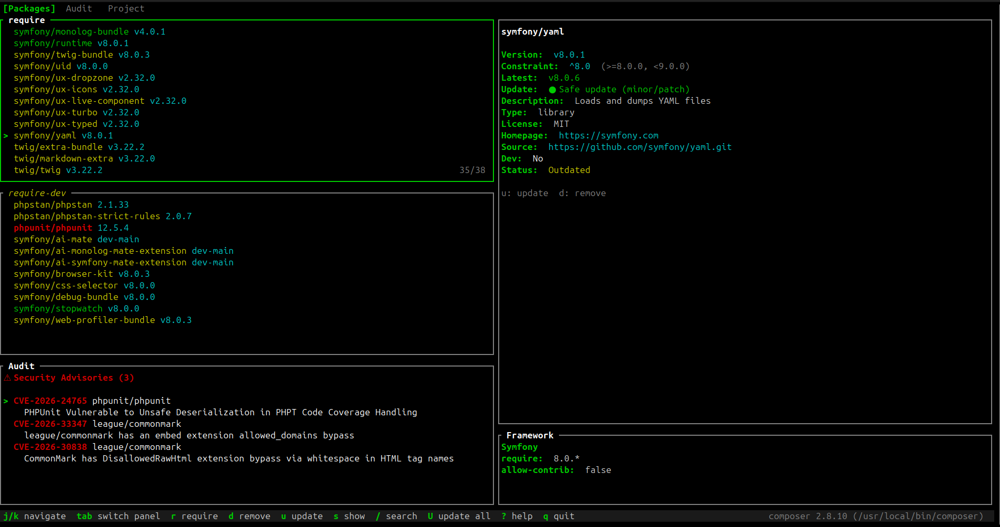

<p align="center">
  
</p>

<h1 align="center">LazyComposer</h1>

<p align="center">
  A terminal user interface (TUI) for managing PHP Composer dependencies, inspired by <a href="https://github.com/jesseduffield/lazygit">lazygit</a>.
</p>

<p align="center">
  <strong>Beta</strong> — This project is under active development. Expect rough edges and breaking changes.
</p>

Built with [ratatui](https://ratatui.rs) + [crossterm](https://github.com/crossterm-rs/crossterm).


## Screenshots





## Features

- **Packages** — Browse all `require` and `require-dev` dependencies with version details
- **Outdated** — See which packages have newer versions available, with color-coded status (safe update / major / abandoned)
- **Audit** — View security advisories and abandoned packages
- **Require** — Add new packages interactively
- **Remove** — Remove packages with confirmation
- **Update** — Update individual packages or all at once
- **Search** — Fuzzy-filter the package list
- **Live output** — Streaming command output displayed in real time

## Prerequisites

- Rust (stable)
- [Composer](https://getcomposer.org/) installed and available in your `PATH` (or set `COMPOSER_BIN`, see below)

## Installation

### From source

```bash
git clone https://github.com/gilles-g/lazycomposer.git
cd lazycomposer
cargo build --release
```

The binary will be at `./target/release/lazycomposer`.

To make it available globally, add it to your `PATH`:

```bash
cp ./target/release/lazycomposer ~/.local/bin/
```

> Make sure `~/.local/bin` is in your `PATH`. If not, add this to your shell config (`~/.bashrc`, `~/.zshrc`, etc.):
>
> ```bash
> export PATH="$HOME/.local/bin:$PATH"
> ```

## Usage

```bash
# In a directory containing a composer.json
lazycomposer

# Or specify the path explicitly
lazycomposer /path/to/my/project
```

## Configuration

### Custom Composer binary

By default, LazyComposer looks for `composer` in your `PATH`. To use a different binary, set the `COMPOSER_BIN` environment variable:

```bash
# Use a specific path
COMPOSER_BIN=/usr/local/bin/composer2 lazycomposer

# Use composer via Docker
COMPOSER_BIN="docker compose exec php composer" lazycomposer
```

## Keybindings

| Key | Action |
|-----|--------|
| `1` `2` `3` | Switch tab (Packages / Outdated / Audit) |
| `tab` / `shift+tab` | Next / previous tab |
| `j` / `k` or arrows | Navigate up / down |
| `shift+tab` | Toggle require / require-dev (Packages tab) |
| `/` | Search / filter packages |
| `r` | Require a new package |
| `d` | Remove selected package |
| `u` | Update selected package |
| `U` | Update all packages (Outdated tab) |
| `esc` | Close overlay / cancel |
| `q` / `ctrl+c` | Quit |

## Development

```bash
cargo build             # Debug build
cargo build --release   # Release build
cargo test              # Run all tests
cargo clippy            # Lint
```

Debug logs are written to `~/.local/state/lazycomposer/debug.log`.

## Architecture

```
src/
├── composer/       # Domain layer (no UI dependency)
│   ├── types.rs    # Package, StringOrBool, AuditResult, Advisory...
│   ├── exec.rs     # Executor trait, RealExecutor, streaming
│   ├── parser.rs   # Parse composer.json + composer.lock
│   └── runner.rs   # Typed wrapper over composer CLI
├── config/         # Config resolution, binary validation
├── security/       # Package name validation, log sanitization
├── logger/         # File logger (~/.local/state/lazycomposer/debug.log)
└── ui/
    ├── app.rs      # Event loop, async loading, key routing
    ├── style/      # Color theme + style functions
    ├── components/ # TabBar, StatusBar, ConfirmDialog, InputBox, Spinner
    └── panels/     # Packages, Outdated, Audit, Output
```

Data loading is asynchronous (background threads + `mpsc` channels) so the UI stays responsive.

## License

MIT
# lazycomposer
